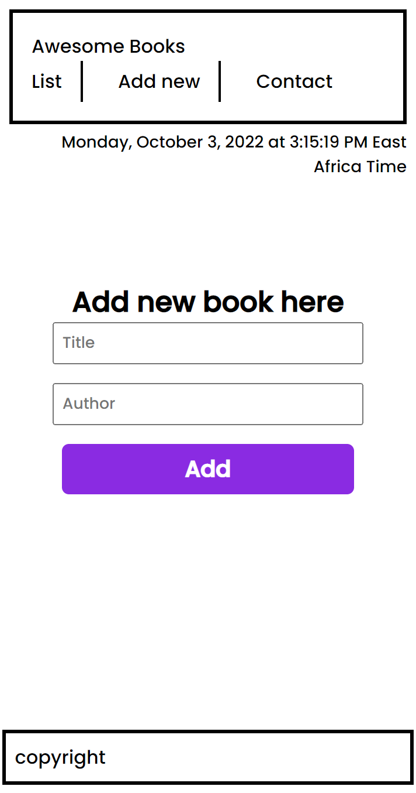

# Project: Awesome Book

## In this milestone I will Recreate the Awesome books: with ES6:

> In this project, I will restructure my Awesome books app code. The goal is to make it more organized by using modules. I will also practice the ES6 syntax that I have learned.

# Project Screenshot image

## Link to the live page

> Feel free to check the [Awesome-Book-link](https://osoro254alex.github.io/Awesome-Book/).

## Getting Started

- Create a local directory that you want to clone the repository.

- Open the command prompt in the created directory.

- On the terminal run this command git clone https://github.com/Osoro254Alex/Awesome-Book

- Go to the repository folder using command prompt cd Awesome-Book.

- Install the dev dependencies for linters run npm install.

## Built with

- HTML, CSS & JAVASCRIPT 

## Authors

👤 **Alex Ogeto**

- GitHub: [@alex_ogeto](https://github.com/Osoro254Alex)
- LinkedIN:[@Osoro254Alex](https://www.linkedin.com/feed/)

## Collaborators

- GitHub Username: [Outkram](https://github.com/Outkarm)
- GitHub Username: [Ridwan](https://github.com/Ridwanullahi-code)

## 🤝 Contributing

Contributions, issues, and feature requests are welcome!
Feel free to check the [issues](https://github.com/Osoro254Alex/Awesome-Book/issues)

## Show your support

Give a ⭐️ if you like this project!

## Acknowledgments

- Hat tip to anyone whose code was used
- Inspiration
- etc

## 📝 License

This project is [MIT](./LICENSE) licensed.

_NOTE: we recommend using the [MIT license](https://choosealicense.com/licenses/mit/) - you can set it up quickly by [using templates available on GitHub](https://docs.github.com/en/communities/setting-up-your-project-for-healthy-contributions/adding-a-license-to-a-repository). You can also use [any other license](https://choosealicense.com/licenses/) if you wish._
